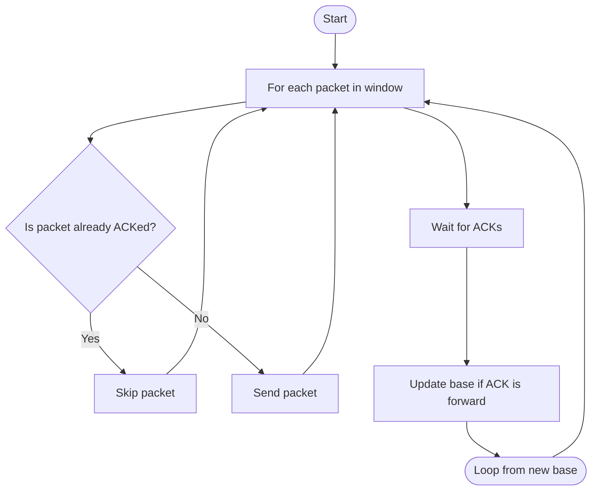
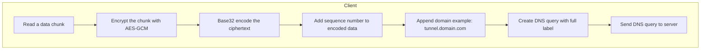
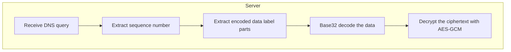

# DNS Tunneling

## 🕳️ DNS Tunneling Protocol

A custom DNS tunneling system that transmits encrypted data using DNS queries. The design supports sliding window logic, chunked payload transmission, and selective-repeat style ACK handling.

---


### 🚀 Installation & Running

```bash
# Install dependencies
pipenv install -r requirements.txt

# Activate the environment
pipenv shell
```

Then set your shared key on both ends:

```bash
export SHARED_KEY="yourkey"
```

#### 🖥️ On the server:

```bash
python dns_server.py
```

#### 💻 On the agent:

```bash
python agent.py
```

By default, both will bind to `127.0.0.1:5053`.

---

### 📂 File I/O

* **Agent (Client)** reads plaintext from:

  ```
  plaintext.txt
  ```

  It splits the file into chunks, encrypts each chunk, and tunnels it through DNS queries.

* **Server** receives and decrypts the data, writing the output to:

  ```
  received.txt
  ```

This allows full file-based transmission from agent to server through the DNS tunnel.


 
---
### 🔧 Features

* ✅ AES-GCM encryption for secure data transmission  
* ✅ Base32 encoding to stay DNS-compliant  
* ✅ Chunked data transfer using a custom subdomain format  
* ✅ Sliding window protocol with selective ACKs  
* ✅ UDP-based transport over DNS  
* ✅ Handles packet loss, retransmission, and reordering  

---

### 📦 Packet Format

#### **DNS Query (Agent → Server)**

Each DNS query carries an encrypted chunk in this format:

```

seq_num.chunk1.chunk2....chunkN.tunnel.domain.com

```

* `seq_num`: 2-digit packet sequence number  
* `chunkX`: base32-encoded segments of the encrypted data  
* `tunnel.domain.com`: your registered domain for tunneling  

#### **Encrypted Payload Structure**

```

[2-byte length][Encrypted Data][16-byte AES-GCM Tag]

```

Encrypted using AES-GCM with a shared 256-bit key.  
The IV (nonce) used in AES-GCM is **counter-based**, and its **initial value is negotiated during a handshake phase**.

---

### 🔁 Sliding Window Logic

#### **Agent Logic**



* Agent sends all packets in window that haven’t been ACKed
* Waits for ACKs embedded in DNS A record responses
* Updates base if ACK confirms forward delivery

---

### 📤 Agent Encoding Pipeline



---

### 📥 Server Decoding Pipeline



---

### 🛡️ ACK Handling

* Server sends back an ACK inside a DNS A record:

  ```
  <rand>.<rand>.<ack_seq>.<rand>
  ```

* ACK is **for the expected sequence number** (i.e. `expected_seq`, or the next one it’s waiting for)

* Agent treats this as an **accumulative ACK** of all prior packets (0 to `expected_seq - 1`)

* If a packet is not acknowledged (e.g. lost), it remains in the window and will be retransmitted

---

### 🔐 Security Notes

* All payloads are encrypted end-to-end
* Uses AES-GCM with 96-bit IV and 128-bit tag
* IV is counter-based and derived during the initial handshake
* Sequence numbers prevent reordering and replay attacks

---

### ⚙️ Handshake Protocol

*TODO: describe the handshake that sets encryption keys, initial IV, and roles.*

---


### 🚧 TODO

* [ ] Add commands for better control
* [ ] Support for bidirectional streams
* [ ] Pluggable compression
* [ ] Better support for I/O  

